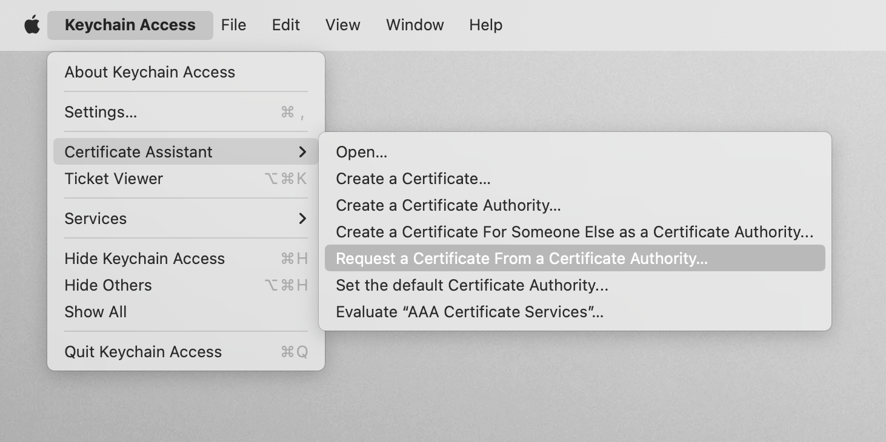
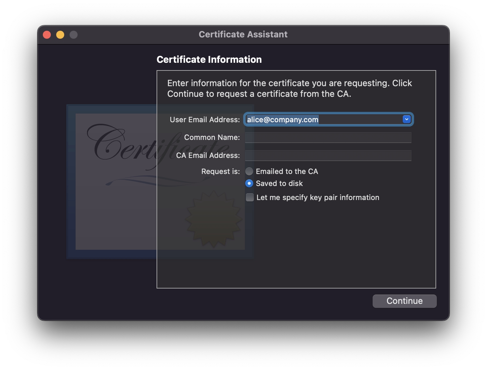
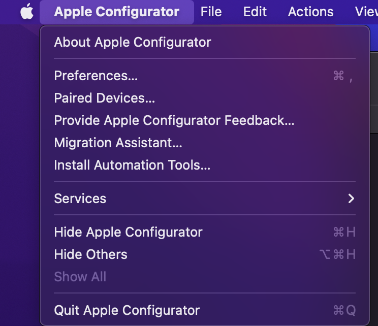

# iOS Guide

## Prerequisites

### Software

- [Xcode](https://developer.apple.com/xcode/resources/) (You won't need to even open it)
- [Apple Configurator][apple-configurator]

### Administravia

To run software on iOS, it must be signed by Xcode using the certificate data
contained in a "Provisioning Profile". This is a file generated by Apple and it
links `app identity`, `certificates` (used for code signing), `app permissions`,
and phystical `devices`.

#### Setup

1. Sign up for a (free) [Apple Developer](https://developer.apple.com/) account.
2. Register your [devices][apple-dev-devices-add] for testing. You can use `ssc mobiledeviceid` command
to get your Device ID (UDID). Device should be connected to your mac by wire.
3. Create a wildcard [App ID][apple-dev-appid] for the application you are developing.
4. Create an [App Store Connect][app-store-connect] record for your app (don't worry about
filling in all the details yet, it just needs to exist).

#### Certificate

1. Open Keychain Access application on your mac (it's in Applications/Utilities).
1. In the Keychain Access application choose Keychain Access -> Certificate Assistant -> Request a Certificate From a Certificate Authority...

1. Type you email in the User Email Address field. Other form elements are optional.

1. Choose Request is Saved to Disc and save your certificate request.
1. [Create][apple-dev-certificates-add] a new iOS Distribution (App Store and Ad Hoc) certificate on the Apple Developers website.
1. Choose a certificate request you've created 2 steps earlier.
1. Download your certificate and double click to add it to your Keychain.

#### Provisioning Profiles

When you run `ssc compile --target=ios .` on your project for the first time, you may see the
following because you don't have a provisioning profile:

```
ssc compile --target=ios .
• provisioning profile not found: /Users/chicoxyzzy/dev/socketsupply/birp/./distribution.mobileprovision. Please specify a valid provisioning profile in the ios_provisioning_profile field in your ssc.config
```

1. [Create][apple-dev-profiles-add] a new Ad Hoc profile. Use the App ID you created with the wildcard.
1. Pick the certificate that you added to your Keychain two steps earlier.
1. Add the devices that the profile will use.
1. Add a name for your new distribution profile (we recommend to name it "distribution").
1. Download the profile and double click it. This action will open Xcode. You can close it after it's completely loaded.
1. Place your profile to your project directory (same directory as ssc.config). *The profiles are secret, add your profile to `.gitignore`*.

### Configuration

1. Set the `ios_team_id` value in `ssc.config` to the value of Team ID [here][apple-dev-membership]
1. Set the `ios_distribution_method` value in `ssc.config` to the `ad-hoc`
1. Set the `ios_signing_certificate` value in `ssc.config` to the [certificate](#certificate) name as it's displayed in the Keychan
1. Set the `ios_provisioning_profile` value in `ssc.config` to the filename of your certificate (i.e., "distribution.mobileprovision").
1. Set the `ios_provisioning_specifier` value in `ssc.config` to the profile name (as in the [Profiles List][apple-dev-profiles-list])

## Run the app in Simulator

```bash
ssc compile --target=iossimulator -r . # create a simulator VM and launch the app in it
```

## Distribution

```bash
ssc compile --target=ios -c -p -xd . # package for distribution
```

### Install application on your device

Install [Apple Configurator][apple-configurator], then connect your device to the computer and use one of methods below.

#### Using ssc

Run `ssc install-app .` from the root directory of your application. If this command fails, follow the instructions from the output or try one of two methods below.

#### Using Apple Configurator application

Connect your device, open the the `Apple Configurator` app and drag
the inner `/dist/build/[your app name].ipa/[your app name].ipa` file onto your phone.

#### Using command-line

1. Open `Apple Configurator` and install Automation Tools from the menu.

1. Run `cfgutil install-app dist/build/[your app name].ipa/[your app name]}.ipa` in your terminal.

### Apple App Store

```bash
xcrun altool --validate-app \
  -f file \
  -t platform \
  -u username [-p password] \
  [--output-format xml]
```

```bash
xcrun altool --upload-app \
  -f file \
  -t platform \
  -u username [-p password] \
  [—output-format xml]
```

## Development

## Debugging

You can run [`lldb`][lldb] and attach to a process, for example...

```bash
process attach --name TestExample-dev
```

### Logging

To see logs, open `Console.app` (installed on MacOS by default) and in the
right side panel pick `<YourSimulatorDeviceName>`. You can filter by `ssc`
to see the logs that your app outputs.

[apple-dev-membership]:https://developer.apple.com/account/#!/membership/
[apple-dev-devices-add]:https://developer.apple.com/account/resources/devices/add
[apple-dev-appid]:https://developer.apple.com/account/resources/identifiers
[app-store-connect]:https://appstoreconnect.apple.com/apps
[apple-dev-profiles-add]:https://developer.apple.com/account/resources/profiles/add
[apple-dev-certificates-add]:https://developer.apple.com/account/resources/certificates/add
[apple-dev-profiles-list]:https://developer.apple.com/account/resources/profiles/list
[lldb]:https://developer.apple.com/library/archive/documentation/IDEs/Conceptual/gdb_to_lldb_transition_guide/document/lldb-terminal-workflow-tutorial.html
[apple-configurator]:https://apps.apple.com/us/app/apple-configurator/id1037126344
