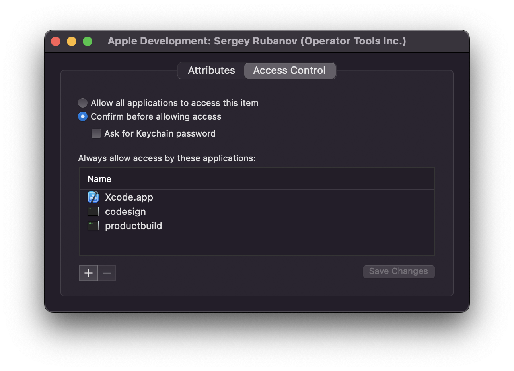
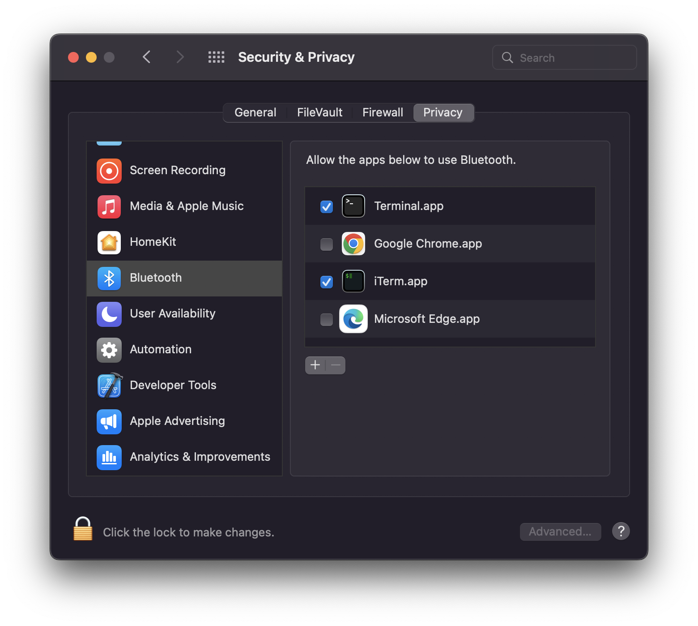

## macOS

### Cashes

To produce a meaningful backtrace that can help debug the crash, you'll need to
resign the binary with the ability to attach the `lldb` debugger tool. You'll
also want to enable core dumps in case the analysis isn't exaustive enough.

```
sudo ulimit -c unlimited # enable core dumps (`ls -la /cores`)
/usr/libexec/PlistBuddy -c "Add :com.apple.security.get-task-allow bool true" tmp.entitlements
codesign -s - -f --entitlements tmp.entitlements ./path/to/your/binary
lldb ./path/to/your/binary # type `r`, then after the crash type `bt`
```

### Clock Drift

If you're running from a VM inside MacOS you may experience clock drift and the signing
tool will refuse to sign. You can set sntp to refresh more frequently with the following
command...

```
sudo sntp -sS time.apple.com
```

### macOS asks for password multiple times on code signing

Open Keychain Access and find your developer certificate under the My Certificates section.
Expand your certificate and double click on a private key. In the dialog click Access Control tab.



`codesign` utility is located in the `/usr/bin/codesign`. To add it to the allowed applications
list click the "+" button to open File Dialog, then press ⌘ + Shift + G and enter `/usr/bin`.
Select `codesign` utility fom Finder.

## Build or compile failures

### `aclocal / automake: command not found`

To build `ssc` for ios you need `automake` / `libtool` installed.

```sh
brew install automake
brew install libtool
```

### `unable to build chain to self-signed root for signer (...)`

You need the intermediate certificate that matches your code signing certificate.
To find which "Worldwide Developer Relations" matches you certificate, open the
signing certificate in your keychain, open [this](https://www.apple.com/certificateauthority/)
page and find the certificate that matches the details in the "Issuer" section
of your certicicate.

### `xcrun: error: SDK "iphoneos" cannot be located`

You have to configure the xcode command line tools, to do this
you can run the following command

```
sudo xcode-select --switch /Applications/Xcode.app
```

### `fatal error: 'lib/uv/include/uv.h' file not found`

Make sure your local `ssc` binary has been compiled with `ios`
parameter in `./bin/bootstrap.sh ios`, otherwise the uv.h
does not exist.

### `unable to find utility simctl`

You need to have [XCode](https://developer.apple.com/xcode/resources/) installed on your macbook.

### `You have not agreed to the Xcode license agreements, please run 'sudo xcodebuild -license' from within a Terminal window to review and agree to the Xcode license agreements.`

You can run `sudo xcodebuild -license` to agree to the license.

### Multiple Password Prompts

If macOS is asking you a password every time you run the command with `-c` flag,
follow [these instructions](/troubleshooting#macos-asks-for-password-multiple-times-on-code-signing)

### Application crashes on start

If you use iTerm2 you can get your app crashing with
```
This app has crashed because it attempted to access privacy-sensitive data without a usage description. The app's Info.plist must contain an NSBluetoothAlwaysUsageDescription key with a string value explaining to the user how the app uses this data.
```
Command line apps inherit their permissions from iTerm, so you need to grant Bluetooth permission to iTerm in macOS system preferences. Go to Security & Privacy, open the Privacy tab and select Bluetooth. Press the "+" button and add iTerm to the apps list.


## Windows

### Development Environment

[`clang++`][0] [version 14][1] required for building.

You will need [build tools][3]

The `WebView2LoaderStatic.lib` file was sourced from [this][2] package.

[0]:https://github.com/llvm/llvm-project/releases/tag/llvmorg-14.0.0
[1]:https://github.com/llvm/llvm-project/releases/download/llvmorg-14.0.0/LLVM-14.0.0-win64.exe
[2]:https://www.nuget.org/api/v2/package/Microsoft.Web.WebView2/1.0.864.35
[3]:https://visualstudio.microsoft.com/downloads/#build-tools-for-visual-studio-2022

### Cannot Run Scripts

If the app cannot be loaded because running scripts is disabled on this system.

```
./bin/bootstrap.ps1 : File C:\Users\user\sources\socket-sdk\bin\bootstrap.ps1 cannot be loaded because running scripts is
disabled on this system. For more information, see about_Execution_Policies at
https:/go.microsoft.com/fwlink/?LinkID=135170.
```

Then you can follow https://superuser.com/a/106363

1. Start Windows PowerShell with the "Run as Administrator" option.
2. `set-executionpolicy remotesigned`

### MSVC

Setting up the MSVC build environment from Git Bash

You can leverage the MSVC build tools (`clang++`) and environment headers directly in Git Bash by loading it into your shell environment directly.
This is possible by running the following command:

```sh
source bin/mscv-bash-env.sh
```

The `bin/bootstrap.sh` shell script should work for compiling the `ssc` tool.
It is also recommneded to initialize this environment when building applications
with `ssc` from the CLI so the correct build tools can be used which ensures
header and library paths for the compiler

## Linux
### Build failures

If you are getting a failure that the build tool cant locate your
compiler, try making sure that the `CXX` environment variable is
set to the location of your C++ compiler (`which g++`, or `which c++`).

The latest version of MacOS should have installed C++ for you. But
on Linux you may need to update some packages. To ensure you have
the latest clang compiler and libraries you can try the follwing...

For debian/ubuntu, before you install the packages, you may want
to [add][0] these software update repos [here][1] to the software
updater.

Note that clang version 14 is only available on Ubuntu 22.04. Use clang 13
for prior versions of Ubuntu.

#### Ubuntu

```sh
sudo apt install \
  build-essential \
  clang-14 \
  libc++1-14-dev \
  libc++abi-14-dev \
  libwebkit2gtk-4.1-dev
```

[0]:https://linuxize.com/post/how-to-add-apt-repository-in-ubuntu/
[1]:https://apt.llvm.org/

#### Arch/Manjaro

arch uses the latest versions, so just install `base-devel`

``` sh
sudo pacman -S base-devel
```

### Multiple g++ versions

If you've tried running the above `apt install` and you get an error
related `Unable to locate package` then you can also install multiple
versions of G++ on your system.

```sh
sudo apt install software-properties-common
sudo add-apt-repository ppa:ubuntu-toolchain-r/test
sudo apt install gcc-9 g++-9 gcc-10 g++-10 gcc-11 g++-11 gcc-12 g++-12
```

Then you can set your C++ compiler as `g++-12`

```sh
# Add this to bashrc
export CXX=g++-12
```

### Can't find Webkit

If you run into an error about not finding webkit & gtk like this:

```
Package webkit2gtk-4.1 was not found in the pkg-config search path.
Perhaps you should add the directory containing `webkit2gtk-4.1.pc'
to the PKG_CONFIG_PATH environment variable
No package 'webkit2gtk-4.1' found
In file included from /home/runner/.config/socket-sdk/src/main.cc:9:
/home/runner/.config/socket-sdk/src/linux.hh:4:10: fatal error: JavaScriptCore/JavaScript.h: No such file or directory
    4 | #include <JavaScriptCore/JavaScript.h>
      |          ^~~~~~~~~~~~~~~~~~~~~~~~~~~~~
compilation terminated.
```

Then you will want to install those dependencies

```sh
sudo apt-get install libwebkit2gtk-4.1-dev
```
